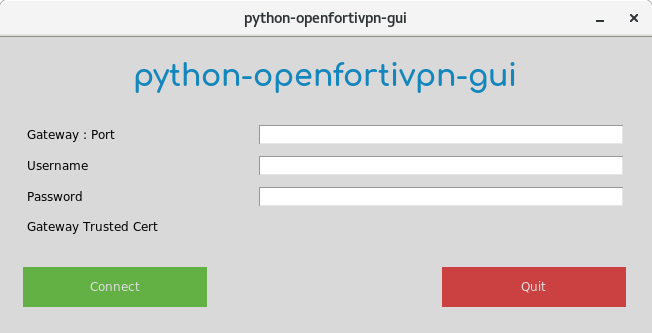

# python-openfortivpn-gui

GUI in development for the openfortivpn writen in Python3

Github page of openfortivpn from Adrien Vergé: https://github.com/adrienverge/openfortivpn

1) Install openfortivpn
2) git clone https://github.com/Myotaro/python-openfortivpn-gui.git
3) cd python-openfortivpn-gui
4) sudo ./main.py

First Python3 project.
Feedbacks are of course very welcome.
